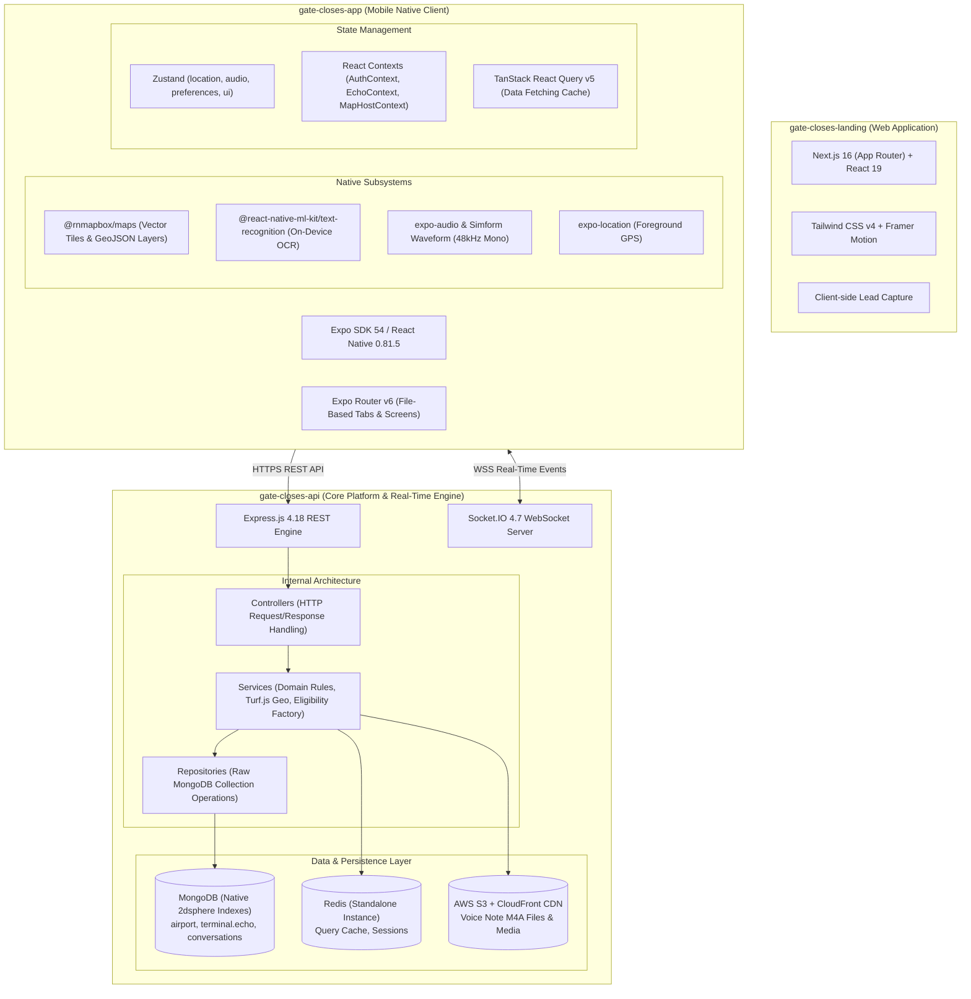
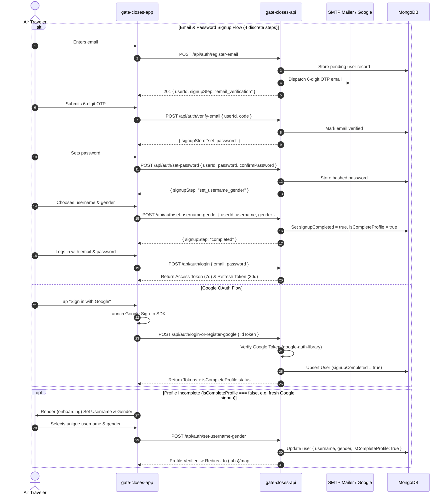
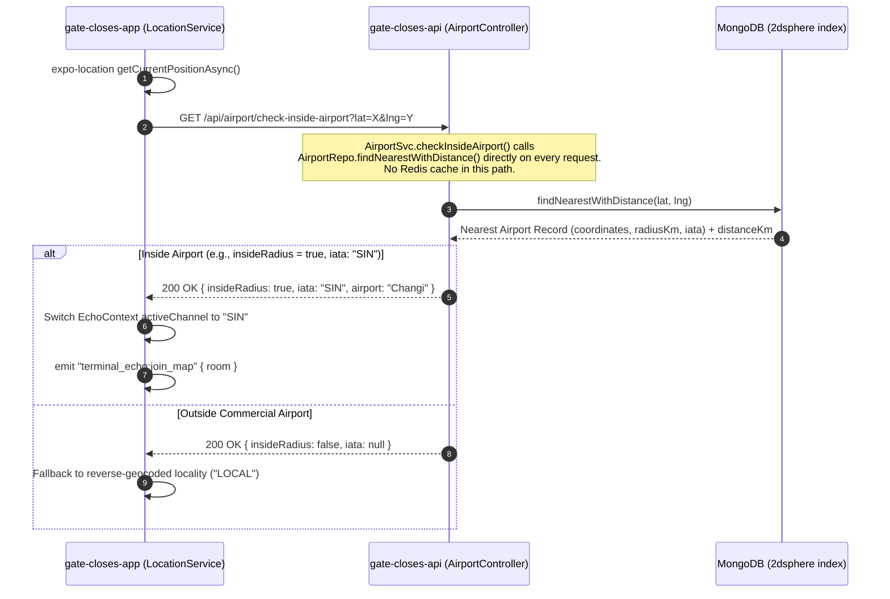
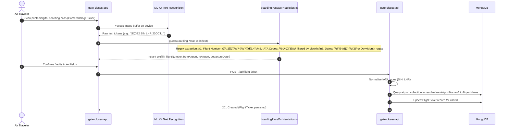
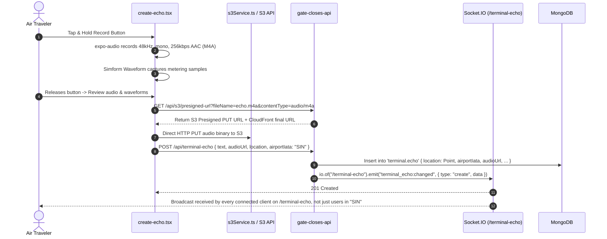
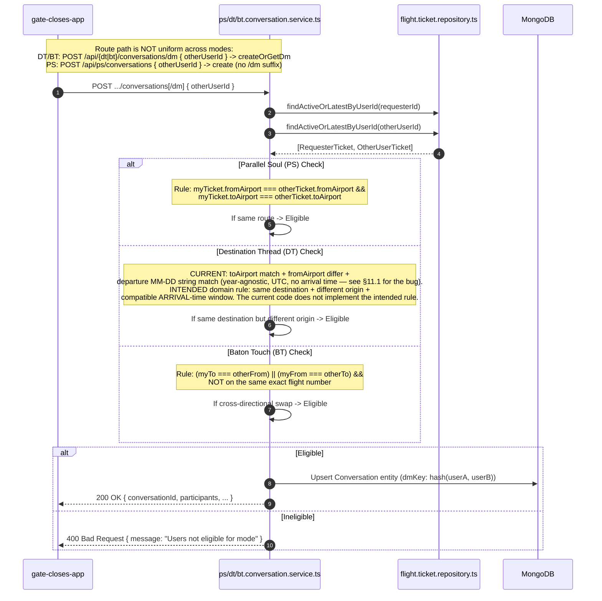
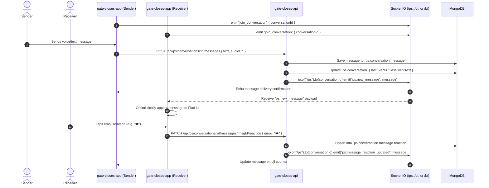
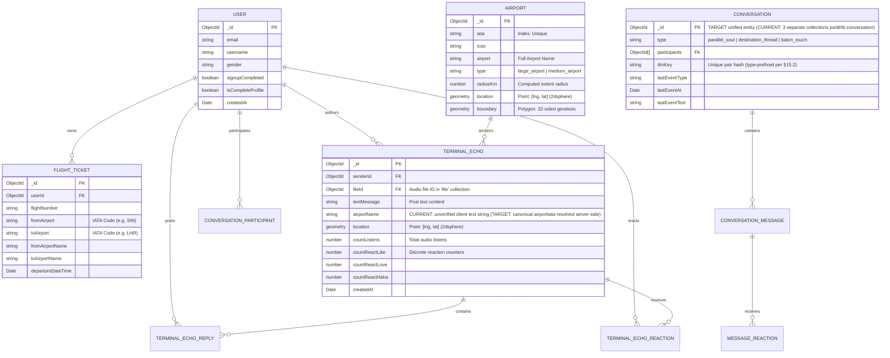
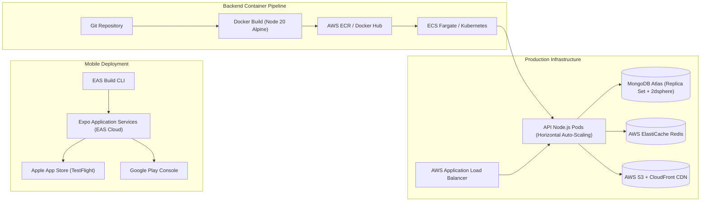

# Gate Closes: Comprehensive System Architecture, Data Flows & Engineering Audit

> **Target Systems:** `gate-closes-api` (Backend), `gate-closes-app` (Mobile), `gate-closes-landing` (Web)  
> **Target Audience:** Principal / Senior Engineers, Engineering Leadership, Solution Architects  
> **Evaluation Scope:** Full End-to-End System Purpose, Technical Architecture, Code Construction, Data Flows, Bottlenecks, and Modernization Blueprint  

---

## Table of Contents
1. [System Purpose & Domain Modeling](#1-system-purpose--domain-modeling)
2. [High-Level Ecosystem Architecture](#2-high-level-ecosystem-architecture)
3. [End-to-End Core User & Data Flows (with Sequence Diagrams)](#3-end-to-end-core-user--data-flows)
   - 3.1 Authentication, Identity & Multi-Stage Onboarding
   - 3.2 Geospatial Airport Boundary & Detection Pipeline
   - 3.3 Boarding Pass Ingestion, On-Device OCR & Route Extraction
   - 3.4 Terminal Echo Creation, Audio Encoding & Spatial Broadcast
   - 3.5 Connection Matching & Eligibility Engine (PS, DT, BT)
   - 3.6 Real-Time Messaging, Waveforms & Reaction Synchronization
4. [Subsystem Deep-Dive & Code Walkthrough](#4-subsystem-deep-dive--code-walkthrough)
   - 4.1 Backend Engine (`gate-closes-api`)
   - 4.2 Mobile Client Engine (`gate-closes-app`)
   - 4.3 Marketing & Presentation Layer (`gate-closes-landing`)
5. [Database Architecture & Entity-Relationship Model](#5-database-architecture--entity-relationship-model)
6. [Senior Engineering Technical Evaluation & Critical Smells](#6-senior-engineering-technical-evaluation--critical-smells)
   - 6.1 The PS / DT / BT Triplication Anti-Pattern
   - 6.2 Real-Time Distributed Bottleneck (Socket.IO In-Memory Isolation)
   - 6.3 Security Deficiencies & Auth Backdoors
   - 6.4 The "God Screen" Monolithic Component Anti-Pattern
   - 6.5 State Management Conflict (Context vs. Zustand vs. React Query)
   - 6.6 Zero-Testing Vacuum
7. [Concrete Refactoring Blueprints & Code Examples](#7-concrete-refactoring-blueprints--code-examples)
   - 7.1 Unified Conversation Domain & Eligibility Strategy Pattern
   - 7.2 Redis Socket Adapter for Horizontal Clustering
   - 7.3 Mobile Screen Decomposition
8. [DevOps, Infrastructure & Production Readiness](#8-devops-infrastructure--production-readiness)
9. [Recommended Architecture & Implementation Roadmap](#9-recommended-architecture--implementation-roadmap)
10. [Priority Order](#10-priority-order)
11. [Immediate Correctness Fixes](#11-immediate-correctness-fixes)
12. [Security Hardening](#12-security-hardening)
13. [Establish Characterization Tests Before Refactoring](#13-establish-characterization-tests-before-refactoring)
14. [Introduce an Explicit Flight Ticket Lifecycle](#14-introduce-an-explicit-flight-ticket-lifecycle)
15. [Unified Conversation Architecture](#15-unified-conversation-architecture)
16. [Eligibility Strategy Design](#16-eligibility-strategy-design)
17. [Preserve the Existing API During Migration](#17-preserve-the-existing-api-during-migration)
18. [Fix Terminal Echo Broadcast Scoping](#18-fix-terminal-echo-broadcast-scoping)
19. [Socket.IO Horizontal Scaling](#19-socketio-horizontal-scaling)
20. [Realtime Architecture Rule](#20-realtime-architecture-rule)
21. [Message Persistence Order](#21-message-persistence-order)
22. [Mobile State Management Ownership](#22-mobile-state-management-ownership)
23. [Decompose the Mobile God Screens](#23-decompose-the-mobile-god-screens)
24. [Decompose `connections/[id].tsx`](#24-decompose-connectionsidx)
25. [Testing Strategy](#25-testing-strategy)
26. [Replace Duplicate Test Files with Parameterized Tests](#26-replace-duplicate-test-files-with-parameterized-tests)
27. [Data & Indexing Recommendations](#27-data--indexing-recommendations)
28. [Idempotency](#28-idempotency)
29. [Media & Echo Security](#29-media--echo-security)
30. [Geospatial Privacy](#30-geospatial-privacy)
31. [Rate Limiting](#31-rate-limiting)
32. [Observability](#32-observability)
33. [Deployment Recommendation](#33-deployment-recommendation)
34. [Do Not Introduce These Technologies Yet](#34-do-not-introduce-these-technologies-yet)
35. [Recommended Implementation Phases](#35-recommended-implementation-phases)
36. [Definition of Done](#36-definition-of-done)
37. [Target Architecture](#37-target-architecture)
38. [Final Engineering Position](#38-final-engineering-position)
39. [Post-Modernization Verification & Merge Hardening Plan](#39-post-modernization-verification--merge-hardening-plan)

---

## 1. System Purpose & Domain Modeling

### 1.1 The Business Problem
Commercial air travel is characterized by high passenger density, shared temporal windows (dwell time at gates, layovers), and common destinations, yet travelers remain isolated. Furthermore, travelers lack hyper-localized, real-time intelligence regarding gate conditions, terminal delays, transfer logistics, and shared destination transit.

### 1.2 Core Value Proposition & Product Mission
**Gate Closes** is a specialized, location-aware social communications platform built around the airport lifecycle. The system tethers users to airport boundaries and automatically discovers flight-based affinities through boarding pass ingestion.

### 1.3 The Four Domain Connection Paradigms

```
                      ┌──────────────────────────────────────────────┐
                      │             AIRPORT ECOSYSTEM                │
                      └──────────────────────┬───────────────────────┘
                                             │
               ┌─────────────────────────────┼────────────────────────────┐
               │                             │                            │
               ▼                             ▼                            ▼
     [TERMINAL ECHO]                 [FLIGHT AFFINITY]           [TRANSIT INTEL]
   Airport-wide broadcast           Direct passenger DMs          Cross-directional
   (Voice / Text / Emoji)                    │                    (Gate handoffs)
                                             │                            │
                              ┌──────────────┴──────────────┐             │
                              ▼                             ▼             ▼
                       [PARALLEL SOUL]            [DESTINATION THREAD] [BATON TOUCH]
                        Same Route                 Converging Route    Opposite / Swap
                       (A -> B  &  A -> B)         (A -> C  &  B -> C) (A -> B  &  B -> A)
```

1. **Terminal Echo (Public Spatial Broadcast)**:
   * Public posts (audio recordings up to 10 seconds or text) anchored to an airport's synthetic boundary.
   * Visible only to users physically within or querying that specific airport channel.
   * Supports threaded text/audio replies and emoji reactions.
2. **Parallel Soul (PS - Same Route Affinity)**:
   * Direct, private 1-on-1 communication channel between travelers who are booked on the **exact same flight route** (identical `fromAirport` IATA and `toAirport` IATA).
3. **Destination Thread (DT - Converging Route Affinity)**:
   * Direct 1-on-1 communication channel between travelers flying into the **same destination airport** (`toAirport`) departing from **different origin airports** (`fromAirport`), arriving around the same temporal window.
4. **Baton Touch (BT - Cross-Directional Transit Handoff)**:
   * Direct 1-on-1 handoff between travelers traveling in **opposite directions** (Passenger 1: $A \rightarrow B$; Passenger 2: $B \rightarrow A$).
   * Designed for exchanging gate status, airport tips, seat advice, terminal transfer logistics, and transit information.

### 1.4 Synthetic Airport Boundaries vs. Real Geofences
A vital architectural decision in Gate Closes is the definition of **Airport Boundaries**:
* Surveyed real-world perimeter fence data is **not** ingested.
* Instead, the system constructs a **synthetic circular polygon (32-sided geodesic polygon via Turf.js)** centered on the airport's reference coordinate (`Point`).
* The radius is determined by airport classification:
  * `large_airport`: $15\text{ km}$ radius
  * `medium_airport`: $8\text{ km}$ radius
  * `small_airport`: $4\text{ km}$ radius
* **Inside check**:
  * `/airport/check-inside-airport`: Computes `spherical distance <= radiusKm` directly (mathematically cheap, no polygon calculation needed).
  * `/airport/check-inside-airport-boundary` & `/airport/geojson`: Generates the 32-sided polygon for Mapbox vector line/fill rendering and point-in-polygon evaluations.

---

## 2. High-Level Ecosystem Architecture

The repository is structured as a top-level workspace containing three standalone projects:



---

## 3. End-to-End Core User & Data Flows

### 3.1 Authentication, Identity & Multi-Stage Onboarding
The onboarding architecture enforces a two-tier identity state:
1. **Signup Completion (`signupCompleted`)**: Email verified via 6-digit OTP and password set, OR authenticated via Google OAuth.
2. **Profile Completion (`isCompleteProfile`)**: Username and gender selected. Google users can be `signupCompleted=true` but `isCompleteProfile=false`.



---

### 3.2 Geospatial Airport Boundary & Detection Pipeline
The mobile client continually resolves the traveler's position to bind them to a specific airport channel.



**Note:** Redis *is* used in `airport.service.ts`, but only by the separate `getAllAsGeoJson()` path (`GET /api/airport/geojson`, cache key `airport:geojson:v1`, TTL 600s/10min) — not by the high-frequency `check-inside-airport` poll shown above, which hits Mongo on every call.

---

### 3.3 Boarding Pass Ingestion, On-Device OCR & Route Extraction
Flight ticket data is the foundational substrate that powers the affinity engine (PS, DT, BT).



---

### 3.4 Terminal Echo Creation, Audio Encoding & Spatial Broadcast
Terminal Echoes provide an audio/text bulletin board localized to the traveler's current airport.



**Correction:** the real event is `terminal_echo:changed` (a generic event carrying `{ type: "create" | ..., data }`), not `terminal_echo:created`. More importantly, the emit targets the **entire `/terminal-echo` namespace**, not an airport-scoped room — clients can `join`/`leave` an arbitrary `room` via `terminal_echo:join_map`/`terminal_echo:leave_map`, but the server-side broadcast on creation doesn't use `.to(room)`, so every connected client receives every echo creation event regardless of airport and must filter client-side. This is a real over-broadcast gap (worth flagging alongside §6.2's Socket.IO scaling issue — it gets worse as user count grows, independent of the missing Redis adapter).

---

### 3.5 Connection Matching & Eligibility Engine (PS, DT, BT)
When a user browses the map or discovers another passenger, the platform evaluates eligibility for private DMs.



---

### 3.6 Real-Time Messaging, Waveforms & Reaction Synchronization
Inside a direct message thread, messages and emoji reactions sync in real-time.



**Correction:** event names are namespace-prefixed per mode, not generic — `ps:new_message` / `ps:message_reaction_updated` on the `/ps` namespace, and correspondingly `dt:new_message` / `dt:message_reaction_updated` on `/dt`, `bt:new_message` / `bt:message_reaction_updated` on `/bt`. This is unlike the Terminal Echo namespace above, which *does* correctly scope its emit `.to(conversationId)` (unlike the unscoped Terminal Echo broadcast).

---

## 4. Subsystem Deep-Dive & Code Walkthrough

### 4.1 Backend Engine (`gate-closes-api`)

#### Directory Map & Architectural Role
```
gate-closes-api/src/
├── app.ts                  # Express application setup, security, Socket.IO instantiation
├── server.ts               # HTTP listen entrypoint
├── config.ts               # Environment variable parsing and type assertions
├── setup.ts                # Startup initialization (Redis connect, Mongo 2dsphere indexes)
├── const.ts                # Constants & Enum definitions (Terminal Echo Types)
├── routes/                 # Express route definitions
│   ├── index.ts            # Route table router aggregator
│   ├── airport.route.ts    # Geospatial airport queries & GeoJSON circles
│   ├── terminal.echo.route.ts # Public echo feeds and map bounding box queries
│   ├── ps.route.ts         # Parallel Soul conversation endpoints
│   ├── dt.route.ts         # Destination Thread conversation endpoints
│   └── bt.route.ts         # Baton Touch conversation endpoints
├── controllers/            # HTTP request parameter validation & response formatting
├── services/               # Core business logic, Turf algorithms, eligibility checks
├── repositories/           # MongoDB collection operations (encapsulated CRUD)
├── models/                 # Domain entity types and TypeScript classes
├── events/                 # Socket.IO connection handlers, namespaces, and rooms
└── utils/                  # Mongo client singleton, Redis client, JWT helpers, S3 client
```

#### Key Implementation Analysis

1. **Geospatial Airport Calculation (`AirportSvc`)**:
   In `src/services/airport.service.ts`, line 68:
   ```typescript
   private static buildBoundaryFromLocationAndRadius(params: {
     location: { type: "Point"; coordinates: [number, number] };
     radiusKm: number;
   }) {
     const { location, radiusKm } = params;
     const [lng, lat] = location.coordinates;
     const center = turf.point([lng, lat]);
     const circle = turf.circle(center, radiusKm, {
       units: "kilometers",
       steps: 32, // Generates smooth 32-sided polygon
     });
     return circle.geometry as { type: "Polygon"; coordinates: number[][][] };
   }
   ```
   *Insight*: The 32-step circle is used for GeoJSON polygon rendering in Mapbox. However, the query `/api/airport/check-inside-airport` computes geodesic distance directly via MongoDB `$geoNear` to avoid expensive point-in-polygon math on high-frequency mobile pings.

2. **MongoDB Connection Singleton (`utils/mongo.ts`)**:
   Uses the native driver (`mongodb: ^7.5.0`) with `MongoClient`. Indexes are initialized idempotently on boot in `src/setup.ts`:
   * `airport`: `{ location: "2dsphere" }`
   * `terminal.echo`: `{ location: "2dsphere" }`

3. **Dynamic Echo Pin Categorization (`TerminalEchoSvc.computeType`)**:
   Located in `src/services/terminal.echo.service.ts` (lines 66–125). When an authenticated user queries airport map pins, the backend compares the viewer's active flight ticket against each echo author's flight ticket to dynamically tag the pin with one of four types:
   * `PARALLEL_SOUL`: Viewer and Author share `fromAirport` and `toAirport`.
   * `DESTINATION_THREAD`: Viewer and Author share `toAirport` but differ in `fromAirport`.
   * `BATON_TOUCH`: Viewer's destination matches Author's origin (or vice versa).
   * `TERMINAL_ECHO`: Standard airport fallback.

---

### 4.2 Mobile Client Engine (`gate-closes-app`)

#### Directory Map & Architectural Role
```
gate-closes-app/
├── app/                    # Expo Router file-based navigation
│   ├── _layout.tsx         # Root layout (Provider tree: Safe Area, Auth, Echo, MapHost)
│   ├── (onboarding)/       # Step-by-step account onboarding & profile setup
│   └── (tabs)/             # Main application bottom-tab bar
│       ├── map/            # Mapbox interactive map with airport polygons & echo pins
│       ├── feed/           # Chronological airport terminal echo cards
│       ├── connections/    # PS, DT, and BT inbox lists and [id].tsx chat screen
│       └── create-echo.tsx # 1,332-line monolithic voice/text creator modal
├── components/             # Reusable UI widgets, Map layers, Audio waveforms
├── contexts/               # React Contexts (AuthContext, EchoContext, MapHostContext)
├── store/                  # Zustand stores (audioStore, locationStore, preferencesStore)
├── services/               # REST API call wrappers, S3 uploaders, Socket.IO clients
└── hooks/                  # Custom React hooks (voice recorder, sockets, layout)
```

#### Key Implementation Analysis

1. **Offline Optical Boarding Pass Extraction (`boardingPassOcrHeuristics.ts`)**:
   Instead of uploading uncompressed ticket images to cloud OCR (which introduces latency and privacy risks), the app runs `@react-native-ml-kit/text-recognition` locally on-device, avoiding uploading the boarding-pass image to a cloud OCR service. (Whether ML Kit uses GPU/NPU acceleration on a given device is a library/platform implementation detail, not something confirmed from the app's own code — the architecturally relevant fact is that OCR happens on-device, not the specific hardware path.)
   The heuristics parser extracts:
   * **Flight Number**: `text.match(/\b([A-Z]{2})\s?-?\s?(\d{2,4})\b/)`
   * **Airport Codes**: Extracts 3-letter uppercase tokens, filtering out boarding pass keywords (`GATE`, `SEAT`, `ZONE`, `BOARDING`, `PASS`, etc.).
   * **Departure Date**: Matches ISO dates or `DD MMM` combinations with calendar year heuristics.

2. **Mapbox Native Integration (`TerminalMapNodesLayer.tsx`)**:
   Uses `@rnmapbox/maps` to render synthetic airport boundaries:
   * `ShapeSource` feeds GeoJSON FeatureCollections generated by the backend.
   * `FillLayer` and `LineLayer` render translucent theme rings around the airport.
   * `SymbolLayer` renders clustered terminal echo pins.

3. **Audio Capture Engine (`create-echo.tsx`)**:
   Configured at lines 46–60 with explicit studio quality parameters:
   * Codec: AAC in MPEG-4 (`.m4a`) container.
   * Sample Rate: 48,000 Hz.
   * Bitrate: 256,000 bps.
   * Audio Source: `AudioSource.VOICE_COMMUNICATION` on Android (activates hardware-level acoustic echo cancellation and automatic gain control).

---

### 4.3 Marketing & Presentation Layer (`gate-closes-landing`)

#### Architectural Highlights
* **Framework**: Next.js 16 (React 19 Server Components) with Tailwind CSS v4.
* **Strict Domain Vocabulary (`CONTEXT.md`)**:
  * **Section Container**: Outer horizontal max-width anchor (`mx-auto max-w-7xl px-4 sm:px-6 lg:px-8`).
  * **Hero Showcase**: Center phone mockup flanked by floating `Terminal Echo` cards (`terminal-echo-{1..4}.svg`).
  * **Anchor Phone & Feature Markers**: Centered phone in Features section surrounded by four map-pin SVGs representing Terminal Echo, Parallel Soul, Destination Thread, and Baton Touch.
  * **Boarding Pass & Airplane Overlay**: Decorative SVG travel metaphor with flight trajectory animations.

---

## 5. Database Architecture & Entity-Relationship Model



---

## 6. Senior Engineering Technical Evaluation & Critical Smells

### 6.1 The PS / DT / BT Triplication Anti-Pattern

```
CURRENT DUPLICATED BACKEND DESIGN:
├── ps.conversation.model.ts          ──►  Identical structure
├── dt.conversation.model.ts          ──►  Identical structure
├── bt.conversation.model.ts          ──►  Identical structure
├── ps.conversation.repository.ts     ──►  Identical Mongo queries
├── dt.conversation.repository.ts     ──►  Identical Mongo queries
├── bt.conversation.repository.ts     ──►  Identical Mongo queries
├── ps.conversation.service.ts        ──►  Identical CRUD (differs ONLY in createDm)
├── dt.conversation.service.ts        ──►  Identical CRUD (differs ONLY in createDm)
└── bt.conversation.service.ts        ──►  Identical CRUD (differs ONLY in createDm)
```

* **Impact**:
  * Over **3,500 lines of redundant boilerplate** across models, message models, reaction models, repositories, services, controllers, routes, and socket handlers.
  * Every schema modification (e.g., adding message read receipts, attachment types, or delivery statuses) requires copy-pasting changes across 12 files.
  * In the mobile app, `connections/[id].tsx` has to import 12 distinct service files and dispatch between them via conditional branches.
* **Architectural Fix**: Replace with a single `Conversation` collection utilizing a `type` discriminator and an **Eligibility Strategy Factory** for validation.

---

### 6.2 Real-Time Distributed Bottleneck (Socket.IO In-Memory Isolation)
* **Code Trace**: `gate-closes-api/src/app.ts` line 43:
  ```typescript
  export const io = new Server(server, { cors: { origin: "*" } });
  ```
* **Failure Mode**:
  Socket.IO uses its built-in in-memory adapter. In a production cloud environment (e.g., AWS ECS, Kubernetes, GCP Cloud Run), if the API is scaled to $\ge 2$ replicas behind a load balancer:
  * Without a shared Socket.IO adapter, room membership and room broadcasts are local to each API instance. If User A is connected to Pod 1 and User B to Pod 2, an event emitted by Pod 1 does not automatically propagate to Pod 2 — so User B will not receive it via that broadcast.
  * Chat messages and real-time echo notifications can silently fail to reach a recipient whenever sender and recipient land on different instances.
* **Architectural Fix**: Install `@socket.io/redis-adapter` and attach it to the existing Redis instance in `src/app.ts`.

---

### 6.3 Security Deficiencies & Auth Backdoors

1. **Authentication Bypass Header (`scoped-auth`)**:
   In `gate-closes-api/src/middleware/valid-session.middleware.ts`, line 6:
   ```typescript
   const scopedAuth = req.headers["scoped-auth"];
   if (scopedAuth && scopedAuth === SECRET_KEY) return next();
   ```
   *Risk*: If `SECRET_KEY` is set to its default (`dev-secret`) or leaked, any caller can bypass all authentication checks without providing a user JWT.

2. **Excessive Token Longevity**:
   In `.env`:
   ```env
   ACCESS_TOKEN_EXPIRY=7d
   REFRESH_TOKEN_EXPIRY=30d
   ```
   *Risk*: A 7-day access token is excessively long. In the event of device theft or token interception, the token cannot be revoked without blacklisting all tokens in Redis. Access tokens should expire in 15–60 minutes, paired with rotating refresh tokens.

3. **Permissive CORS Configuration**:
   ```typescript
   app.use(cors({ origin: "*", credentials: true }));
   ```
   *Risk*: Wildcard CORS combined with credentials is a security risk and violates standard browser security models.

---

### 6.4 The "God Screen" Monolithic Component Anti-Pattern

| Screen Component | File Path | Line Count | File Size | Critical Responsibilities Bundled Together |
| :--- | :--- | :---: | :---: | :--- |
| **`create-echo.tsx`** | `gate-closes-app/app/(tabs)/create-echo.tsx` | **1,332** | 57 KB | Audio recording permissions, hardware metering loop, Simform waveform visualizer, S3 presigned upload, Reanimated gesture physics, GPS polling, form state. |
| **`connections/[id].tsx`** | `gate-closes-app/app/(tabs)/connections/[id].tsx` | **1,161** | 46 KB | 12 imported PS/DT/BT services, voice player engine, socket listeners, reaction modal, FlatList pagination, header rendering. |

* **Impact**: Violates Single Responsibility Principle. Complex re-render cascades occur during audio recording (metering updates re-render the entire screen tree). Refactoring or debugging state transitions is brittle.

---

### 6.5 State Management Conflict (Context vs. Zustand vs. React Query)
The mobile app simultaneously maintains:
1. **4 Zustand Stores**: `locationStore`, `audioStore`, `preferencesStore`, `uiStore`.
2. **3 Heavy Contexts**: `EchoContext.tsx` is **785 lines**, manually managing queries, mutating local state, and subscribing to socket events.
3. **TanStack React Query**: Used inside contexts and screens.
* **Problem**: `EchoContext` manually invalidates and mutates query cache data while attempting to keep optimistic counts in sync with inconsistent WebSocket payloads. This causes dual-state divergence and race conditions.

---

### 6.6 Zero-Testing Vacuum
* **Backend**: Only 7 test files in `test/`, where `bt.conversation.read-state.spec.ts`, `dt.conversation.read-state.spec.ts`, and `ps.conversation.read-state.spec.ts` are 6,444-byte identical duplicates.
* **Mobile**: Exactly **0 automated unit, component, or E2E tests**. Any change to boarding pass OCR or audio recording must be manually verified across physical hardware.

---

## 7. Concrete Refactoring Blueprints & Code Examples

### 7.1 Unified Conversation Domain & Eligibility Strategy Pattern

#### Target Model (`gate-closes-api/src/models/conversation.model.ts`)
```typescript
import { ObjectId } from "mongodb";

export type ConversationType = "parallel_soul" | "destination_thread" | "baton_touch";

export interface IConversation {
  _id?: ObjectId;
  type: ConversationType;
  participants: ObjectId[];
  dmKey: string; // Hash of sorted participant IDs
  lastEventType?: "message_sent" | "message_reacted";
  lastEventAt?: Date;
  lastEventActorId?: ObjectId;
  lastEventText?: string;
  createdAt: Date;
  updatedAt: Date;
}
```

#### Strategy Pattern for Eligibility (`gate-closes-api/src/services/eligibility/`)
```typescript
import { TFlightTicket } from "../../models/flight.ticket.model";
import { ConversationType } from "../../models/conversation.model";

export interface IEligibilityStrategy {
  isEligible(ticketA: TFlightTicket, ticketB: TFlightTicket): boolean;
  rejectionReason(): string;
}

export class ParallelSoulStrategy implements IEligibilityStrategy {
  isEligible(ticketA: TFlightTicket, ticketB: TFlightTicket): boolean {
    return (
      ticketA.fromAirport === ticketB.fromAirport &&
      ticketA.toAirport === ticketB.toAirport
    );
  }
  rejectionReason() {
    return "Users are not traveling the exact same route.";
  }
}

export class BatonTouchStrategy implements IEligibilityStrategy {
  isEligible(ticketA: TFlightTicket, ticketB: TFlightTicket): boolean {
    const crossMatch =
      ticketA.toAirport === ticketB.fromAirport ||
      ticketA.fromAirport === ticketB.toAirport;
    const sameFlight =
      ticketA.flightNumber === ticketB.flightNumber &&
      ticketA.departureDateTime?.getTime() === ticketB.departureDateTime?.getTime();
    return crossMatch && !sameFlight;
  }
  rejectionReason() {
    return "Users are not eligible for a cross-directional baton touch.";
  }
}

export class DestinationThreadStrategy implements IEligibilityStrategy {
  isEligible(ticketA: TFlightTicket, ticketB: TFlightTicket): boolean {
    return (
      ticketA.toAirport === ticketB.toAirport &&
      ticketA.fromAirport !== ticketB.fromAirport
    );
  }
  rejectionReason() {
    return "Users do not share the same destination from different origins.";
  }
}

export class EligibilityFactory {
  private static strategies: Record<ConversationType, IEligibilityStrategy> = {
    parallel_soul: new ParallelSoulStrategy(),
    baton_touch: new BatonTouchStrategy(),
    destination_thread: new DestinationThreadStrategy(),
  };

  static get(type: ConversationType): IEligibilityStrategy {
    const strategy = this.strategies[type];
    if (!strategy) throw new Error(`Unknown conversation mode: ${type}`);
    return strategy;
  }
}
```

---

### 7.2 Redis Socket Adapter for Horizontal Clustering

#### Updating `gate-closes-api/src/app.ts`
```typescript
import { createServer } from "http";
import { Server } from "socket.io";
import { createAdapter } from "@socket.io/redis-adapter";
import RedisUtil from "./utils/redis.util";

const server = createServer(app);

export const io = new Server(server, {
  cors: {
    origin: process.env.ALLOWED_ORIGINS?.split(",") ?? ["http://localhost:3000"],
    credentials: true,
  },
});

// Configure Redis pub/sub adapter for multi-instance scaling
const pubClient = RedisUtil.useConnection();
const subClient = pubClient.duplicate();

Promise.all([pubClient.connect(), subClient.connect()]).then(() => {
  io.adapter(createAdapter(pubClient, subClient));
  console.log("[Socket.IO] Redis adapter initialized successfully.");
});
```

---

### 7.3 Mobile Screen Decomposition

#### Target Decomposition for `create-echo.tsx`
```
app/(tabs)/create-echo/
├── index.tsx                         # Thin screen coordinator (max 150 LOC)
├── hooks/
│   ├── useEchoRecorder.ts            # Hardware audio recording & metering state
│   └── useEchoUploader.ts            # S3 presigned URL generation and direct binary PUT
└── components/
    ├── AudioWaveformVisualizer.tsx   # Simform waveform canvas & level meters
    ├── EchoTextInput.tsx             # Text input & keyboard avoidance wrappers
    └── AirportChannelBadge.tsx       # Location pill displaying active airport IATA
```

---

## 8. DevOps, Infrastructure & Production Readiness



### Production Readiness Checklist
1. **Container Hardening**: Update `Dockerfile` to use multi-stage builds with a non-root `node` user and dumb-init.
2. **Environment Isolation**: Prevent `.env` files with `"dev-secret"` defaults from loading in production; inject credentials via AWS Secrets Manager or HashiCorp Vault.
3. **Database Performance**: Ensure appropriate indexes on MongoDB collections:
   * `terminal.echo`: `{ airportIata: 1, createdAt: -1 }` (TARGET index once §18.1 resolves canonical IATA; CURRENT uses `{ location: "2dsphere" }`)
   * `conversation`: `{ dmKey: 1 }` unique (type-prefixed per §15.2 / §27)
   * `conversation.message`: `{ conversationId: 1, createdAt: -1 }`
4. **Automated Testing & CI/CD**:
   * Setup GitHub Actions workflow for linting, type-checking, and test execution on all pull requests.
   * Add Maestro / Detox E2E tests for the core Mobile flow: Onboarding $\rightarrow$ Boarding Pass OCR $\rightarrow$ Echo Creation.

---

# 9. Recommended Architecture & Implementation Roadmap

## 9.1 Executive Recommendation

> **Current vs. Target:** Sections 1–8 document *observed* architecture and behavior, verified against the repository. Section 9 onward defines *recommended* changes. A target-state requirement (e.g. a field, index, or lifecycle state that doesn't exist yet) must not be read as an existing implementation fact — each is marked **CURRENT** or **TARGET** below where the distinction matters.

Based on the fact-checked architecture and code walkthrough in Sections 1–8, **Gate Closes should not undergo a full architectural rewrite**.

The existing platform has a viable foundation:

* Express.js modular backend
* MongoDB with native driver and `2dsphere` geospatial indexing
* Redis
* Socket.IO
* AWS S3 / CloudFront
* Expo / React Native mobile client
* Next.js landing application

The primary problem is not the choice of technology.

The primary problems are:

1. Security weaknesses in the authentication boundary.
2. Incorrect and insufficiently deterministic flight-affinity eligibility logic.
3. PS / DT / BT implementation duplication.
4. Incorrect Terminal Echo broadcast scoping.
5. Socket.IO's inability to coordinate broadcasts across multiple API instances.
6. Excessive responsibility inside critical mobile screens and contexts.
7. Zero automated mobile test coverage and insufficient backend characterization coverage.
8. Lack of explicit ticket lifecycle and temporal semantics.

The recommended strategy is therefore:

> **Harden first, characterize current behavior, correct domain rules, consolidate duplicated implementations, then scale the existing architecture.**

Do not introduce microservices, Kubernetes, Kafka, GraphQL, CQRS, event sourcing, or a new database architecture at this stage.

Gate Closes should remain a **modular monolith with clear domain boundaries** until actual scale or organizational requirements demonstrate that decomposition is necessary.

---

# 10. Priority Order

The implementation should follow this priority order.

| Priority | Workstream                                             | Reason                                                                   |
| -------- | ------------------------------------------------------ | ------------------------------------------------------------------------ |
| P0       | Authentication & authorization hardening               | Security boundary must be trustworthy before further expansion           |
| P0       | DT temporal semantics & correctness                    | Current behavior doesn't match the documented DT rule — but "fix" first requires establishing an authoritative arrival-time source, since `arrivalDateTime` doesn't exist yet (see §11.1) |
| P0       | Terminal Echo broadcast scoping + server-authoritative airport resolution | Creation event is broadcast to the entire namespace, AND the client-supplied `airportName`/`location` are trusted as-is with no server-side resolution against the `airport` collection (see §18) |
| P1       | Characterization tests                                 | Establish behavior before large refactors                                |
| P1       | Flight ticket lifecycle & deterministic eligibility    | PS / DT / BT depend on correct ticket selection                          |
| P1       | Unified Conversation domain                            | Removes the largest source of backend/mobile duplication                 |
| P1       | Socket.IO Redis adapter                                | Required before horizontal realtime scaling                              |
| P1       | Mobile state ownership                                 | Reduce Context/Zustand/React Query divergence                            |
| P2       | Mobile screen decomposition                            | Improve maintainability after behavior is protected by tests             |
| P2       | Rate limiting / media authorization / privacy controls | Protect public social and media surfaces                                 |
| P2       | Observability & production hardening                   | Improve operational reliability                                          |
| P2       | E2E testing and deployment automation                  | Establish repeatable release validation                                  |

This ordering deliberately avoids beginning with the largest refactor.

## 10.1 Expanded Priority (with sub-dependencies made explicit)

The table above collapses some real sequencing dependencies. Expanded:

```text
P0-A  Establish DT temporal semantics
      └─ authoritative arrival-time source (doesn't exist yet — §11.1)
      └─ timezone policy
      └─ temporal window definition

P0-B  Security boundary
      └─ remove/constrain scoped-auth
      └─ secrets fail closed
      └─ token lifetime/rotation
      └─ explicit CORS
      └─ domain authorization

P0-C  Terminal Echo correctness
      └─ server resolves airport server-side (§18.1) — not client airportName/location
      └─ authorized airport room
      └─ no global namespace broadcast

P1-A  Characterization tests (PS/DT/BT, ticket selection, Echo, socket rooms, auth)

P1-B  Ticket lifecycle + relevant-ticket selection

P1-C  Unified Conversation domain
      └─ type-aware dmKey, unified messages/reactions/read-state, compatibility routes

P1-D  Socket.IO Redis adapter
      └─ only after P0-C room semantics are correct (§19 sequencing note)
      └─ two-instance testing

P2-A  Mobile state ownership
P2-B  Mobile screen decomposition
P2-C  Rate limiting / media / privacy
P2-D  Observability / CI / E2E / deployment hardening
```

---

# 11. Immediate Correctness Fixes

## 11.1 Fix the DT Temporal Matching Bug First

The current DT implementation contains a concrete correctness problem.

The implementation compares:

```typescript
new Date(ticket.departureDateTime).toISOString().slice(5, 10)
```

This creates three problems.

### Problem 1 — Departure time is used instead of arrival time

Destination Thread is defined as a relationship between travelers arriving at the same destination around the same temporal window.

Therefore, the eligibility calculation should be based on **arrival time**, not departure time.

### Problem 2 — The year is discarded

Using:

```typescript
.slice(5, 10)
```

reduces the comparison to:

```text
MM-DD
```

Therefore:

```text
2026-03-15
2020-03-15
2031-03-15
```

can all compare as:

```text
03-15
```

This is incorrect.

### Problem 3 — UTC calendar slicing is not equivalent to local travel time

Using:

```typescript
toISOString()
```

before extracting a calendar date means the comparison is performed against UTC rather than the relevant airport/travel timezone.

A late-night local departure or arrival can therefore cross a UTC date boundary.

### Required correction

**CURRENT:** `FlightTicket` (`gate-closes-api/src/models/flight.ticket.model.ts`) only persists `departureDateTime` (and `returnDateTime`) — there is no `arrivalDateTime` field today. So "compare arrival time" is not a one-line fix to an existing field; it's new model work.

**TARGET:** the domain model should contain explicit temporal data:

```typescript
departureDateTime
arrivalDateTime
```

with a clearly defined normalization policy. Before adding the field, first establish the *authoritative source* of arrival time (OCR-extracted? computed from flight duration lookup? entered by the user?) — do not derive it as `departureDateTime + arbitrary duration` unless that's an explicit, documented product decision. If reliable arrival time cannot currently be sourced, DT eligibility cannot be made fully correct until it can; the interim fix (below) at least corrects the year/timezone bugs in the existing departure-based comparison.

The DT strategy should then evaluate:

```text
same destination
AND different origin
AND arrival times fall within the configured DT temporal window
```

The temporal window must be defined explicitly rather than inferred from a calendar-day string.

For example:

```typescript
interface TravelWindow {
  departureAt: Date;
  arrivalAt: Date;
}
```

and:

```typescript
interface EligibilityContext {
  now: Date;
  ticketA: TFlightTicket;
  ticketB: TFlightTicket;
}
```

The exact DT window should be a product/domain decision, but the implementation must compare actual timestamps rather than month/day strings.

### Acceptance Criteria

DT must:

* compare destination airports;
* require different origins;
* compare arrival time rather than departure date;
* preserve the year;
* use normalized timestamps;
* avoid implicit UTC calendar-day semantics;
* reject expired/irrelevant tickets;
* have automated tests covering timezone and year-boundary cases.

This should be completed **before the PS/DT/BT consolidation** so the unified implementation does not reproduce the current defect.

---

# 12. Security Hardening

Security work should be completed before exposing additional functionality or scaling the service.

## 12.1 Remove the `scoped-auth` Authentication Bypass

Current code:

```typescript
const scopedAuth = req.headers["scoped-auth"];

if (scopedAuth && scopedAuth === SECRET_KEY) {
  return next();
}
```

This creates an alternate authentication path that bypasses normal user authentication.

If an internal service credential is genuinely required, it must not be implemented as a global user-auth bypass.

Instead:

```text
External request
    ↓
Normal user authentication
    ↓
User authorization
```

and separately:

```text
Trusted internal service
    ↓
Explicit internal-auth middleware
    ↓
Explicit internal-only endpoint
```

The two authentication models must remain separate.

The production application must also fail closed if a required secret is missing or left at a development default.

---

## 12.2 Reduce Access Token Lifetime

The current 7-day access token lifetime should be replaced with a substantially shorter access-token lifetime.

Recommended baseline:

```text
Access token: approximately 15–30 minutes
Refresh token: longer-lived
Refresh tokens: rotated
Reuse detection: enabled
```

The exact values should be configurable through environment variables.

The objective is to reduce the impact window of a stolen access token without forcing users to repeatedly authenticate.

---

## 12.3 Replace Wildcard CORS

Current:

```typescript
app.use(cors({
  origin: "*",
  credentials: true
}));
```

Production should use an explicit origin allowlist.

Example configuration concept:

```text
ALLOWED_ORIGINS=
https://gate-closes.com,
https://www.gate-closes.com
```

Development origins should be explicitly configured rather than relying on `*`.

CORS configuration should be centralized so REST and realtime authentication policies do not diverge.

---

## 12.4 Add Authorization at the Domain Boundary

Authentication alone is insufficient.

The server must verify:

* the authenticated user owns the relevant flight ticket;
* the authenticated user may create the requested conversation;
* both participants belong to the conversation;
* the authenticated user may join the requested Socket.IO room;
* the authenticated user may send a message;
* the authenticated user may react to a message;
* the authenticated user may create an Echo;
* the Echo's airport/location data is valid;
* the uploaded media belongs to the authenticated operation.

Client-provided identifiers must never be treated as authoritative.

---

# 13. Establish Characterization Tests Before Refactoring

The current codebase has insufficient automated coverage to safely perform a large PS/DT/BT consolidation.

Before deleting the duplicated implementations, create tests that describe the **current intended domain behavior**.

## 13.1 Backend Characterization Tests

Create a test matrix for:

### Parallel Soul

```text
same origin + same destination = eligible
different origin = rejected
different destination = rejected
```

### Destination Thread

```text
same destination + different origin + valid arrival window = eligible
same destination + same origin = rejected
different destination = rejected
outside arrival window = rejected
different years = handled correctly
timezone boundary = handled correctly
```

### Baton Touch

```text
A → B + B → A = eligible
A → B + B → C = rejected
same exact flight = rejected
```

Also test:

```text
self conversation
missing ticket
expired ticket
multiple tickets
inactive ticket
duplicate conversation
```

(`blocked participant` is deferred until block/report/mute functionality exists in the product — see §16's note on `BLOCKED_USER`.)

---

# 14. Introduce an Explicit Flight Ticket Lifecycle

The current:

```typescript
findActiveOrLatestByUserId()
```

pattern is too ambiguous for a time-sensitive affinity system.

A user can have:

```text
Past flight
Current flight
Upcoming flight
Multiple future flights
```

Therefore, eligibility should not simply mean:

> "Give me the latest ticket."

Instead, introduce explicit ticket lifecycle semantics.

These are recommended conceptual lifecycle *semantics*, not an immediate schema migration requirement — the exact persisted state names should follow the existing ticket model and whatever the product actually needs, not be adopted verbatim from this list:

```text
CREATED
UPCOMING
ACTIVE
COMPLETED
EXPIRED
ARCHIVED
```

The exact enum names may differ from the implementation, but the semantics should be explicit.

The system should determine which ticket is relevant using:

```text
current time
departure time
arrival time
ticket status
```

rather than relying on insertion order or "latest" semantics.

---

# 15. Unified Conversation Architecture

Once behavior is protected by tests and ticket semantics are corrected, consolidate PS, DT and BT.

## 15.1 One Conversation Domain

Use one domain model:

```typescript
type ConversationType =
  | "parallel_soul"
  | "destination_thread"
  | "baton_touch";
```

and one Conversation collection.

The common infrastructure should own:

* conversation creation;
* participant management;
* message persistence;
* reactions;
* read state;
* pagination;
* last-event metadata;
* authorization;
* socket room management.

Only eligibility should vary by conversation type.

---

## 15.2 Correct the Conversation Key

The current conceptual key:

```text
hash(sortedUserA, sortedUserB)
```

is insufficient if the same pair of users can legitimately qualify for multiple conversation types.

For example, two users could qualify for different relationship modes under different flights.

Use a type-aware deterministic key:

```text
type + sortedParticipantIds
```

Conceptually:

```text
parallel_soul:userA:userB
destination_thread:userA:userB
baton_touch:userA:userB
```

Then hash the complete canonical representation if desired.

The database should enforce uniqueness.

Example:

```text
unique dmKey
```

This prevents duplicate conversations caused by concurrent requests.

If the product intentionally wants only one relationship thread between two users regardless of type, that must instead be an explicit product rule and represented accordingly. The data model should not accidentally make that decision.

---

# 16. Eligibility Strategy Design

The Strategy Pattern proposed in §7.1 is directionally correct, but it should be strengthened.

Instead of returning only:

```typescript
boolean
```

prefer a result that can explain the decision.

Example:

```typescript
interface EligibilityResult {
  eligible: boolean;
  reason:
    // relevant now — no new product capability required
    | "ELIGIBLE"
    | "NO_TICKET"
    | "DIFFERENT_ROUTE"
    | "DIFFERENT_DESTINATION"
    | "OUTSIDE_TIME_WINDOW"
    | "EXPIRED_TICKET"
    | "SAME_FLIGHT"
    | "SELF_CONVERSATION"
    // future — only add once blocking/privacy features actually exist;
    // the codebase has no block/report/mute functionality today
    | "BLOCKED_USER"
    | "PRIVACY_RESTRICTION";
}
```

The strategy should remain responsible only for **domain eligibility**.

The application service should remain responsible for:

* loading users;
* selecting relevant tickets;
* checking blocked/privacy state;
* creating or retrieving the conversation;
* persistence;
* transaction/idempotency behavior.

This prevents the Strategy Pattern from becoming another large service abstraction.

---

# 17. Preserve the Existing API During Migration

Do not immediately remove:

```text
/api/ps/...
/api/dt/...
/api/bt/...
```

The current API is asymmetric:

```text
POST /api/ps/conversations
POST /api/dt/conversations/dm
POST /api/bt/conversations/dm
```

Existing clients should continue functioning during migration.

Internally:

```text
Legacy PS route ─┐
Legacy DT route ─┼──> Unified Conversation Service
Legacy BT route ─┘
```

The unified service should become the actual domain owner.

Later, a canonical API can be introduced:

```text
POST /api/conversations
GET  /api/conversations/:id
POST /api/conversations/:id/messages
PATCH /api/conversations/:id/messages/:messageId/reaction
```

with:

```json
{
  "type": "parallel_soul",
  "otherUserId": "..."
}
```

Legacy endpoints can then be deprecated and removed after mobile migration is complete.

---

# 18. Fix Terminal Echo Broadcast Scoping

This is an independent correctness and scalability issue.

The current Terminal Echo creation event:

```text
terminal_echo:changed
```

is emitted to the entire:

```text
/terminal-echo
```

namespace.

Therefore, an Echo created for:

```text
SIN
```

can reach clients who are not in the SIN airport room.

Clients currently perform filtering after receiving the event.

This should be server-side scoped.

The intended flow should be:

```text
Create Echo
    ↓
Validate airport
    ↓
Persist Echo
    ↓
Emit to airport room
    ↓
airport:SIN
```

Conceptually:

```typescript
io.of("/terminal-echo")
  .to(`airport:${airportIata}`)
  .emit("terminal_echo:changed", payload);
```

The exact room naming should follow the existing Socket.IO implementation.

The important rule is:

> **The server determines the audience. Clients should not receive unrelated airport events merely to filter them locally.**

## 18.1 Server-Authoritative Airport Resolution (a distinct, sharper issue than scoping alone)

**CURRENT:** the creation request body (`terminal.echo.controller.ts` → `TerminalEchoSvc.createTerminalEcho`) is validated with Joi for shape only — `location: {type, coordinates}` and `airportName: string`. Note this is `airportName` (a free-text string), **not** `airportIata` as earlier diagrams in this document simplified it to. The service passes both straight through to persistence with no cross-check against the `airport` collection: nothing verifies that the supplied `airportName` actually corresponds to the supplied `location`, nor that `location` is really inside that airport's service radius. A client can submit `airportName: "Changi Airport"` with arbitrary coordinates, or vice versa, and the echo persists as given.

**TARGET acceptance criteria for the Echo fix (in addition to broadcast scoping above):**

```text
Authenticated user
       ↓
Server validates coordinates
       ↓
Server resolves the authoritative airport server-side (same lookup as check-inside-airport)
       ↓
Server determines the authorized airport channel from that resolution, not from client input
       ↓
Server persists canonical airportIata + location
       ↓
Server emits to the resolved, authorized room
```

Client-supplied `airportName`/`location` should be treated as a hint for UX responsiveness at most, never as the authoritative value written to the database or used to pick the broadcast room.

---

# 19. Socket.IO Horizontal Scaling

The existing in-memory adapter is acceptable for a single API instance.

It is not sufficient once multiple API instances need to share realtime events.

Target architecture:

```text
                 ┌───────────────┐
                 │ AWS ALB       │
                 └───────┬───────┘
                         │
              ┌──────────┴──────────┐
              ▼                     ▼
        API Instance A        API Instance B
              │                     │
              └──────────┬──────────┘
                         ▼
                   Redis Adapter
                         │
                         ▼
                       Redis
```

Install:

```text
@socket.io/redis-adapter
```

but do not blindly copy a Redis initialization snippet into `app.ts`.

The existing Redis utility and startup lifecycle should first be inspected.

The implementation must ensure:

1. dedicated Redis pub/sub connections;
2. adapter initialization occurs reliably;
3. connection failures are handled;
4. application startup behavior is deterministic;
5. graceful shutdown closes Redis connections;
6. realtime behavior is tested across two API instances.

The adapter should be initialized as part of application startup — before the server begins accepting production traffic — rather than attached asynchronously after traffic is already flowing. Attaching it late creates a window where early connections join rooms on an instance with no cross-instance propagation yet configured.

**Sequencing dependency:** room authorization and room scoping (§18) must be correct *before* the Redis adapter is introduced. The adapter distributes whatever room/event behavior already exists — if room membership is unauthorized or broadcasts are unscoped (as in §18.1), Redis will simply make that same incorrect behavior distributed across instances instead of fixing it. Order: room authorization → room scoping → Redis adapter → two-instance testing.

Redis adapter configuration should be treated as a **distributed coordination mechanism**, not as the source of truth.

MongoDB remains the durable source of truth.

---

# 20. Realtime Architecture Rule

The system should follow this rule:

```text
MongoDB
    = source of truth

REST API
    = authoritative state retrieval/mutation

Socket.IO
    = realtime delivery

Redis
    = distributed coordination/cache/socket adapter
```

A Socket.IO event should never be the only copy of important state.

If a client disconnects:

```text
Reconnect
   ↓
Fetch authoritative state
   ↓
React Query updates cache
   ↓
Resume realtime subscriptions
```

This makes realtime delivery recoverable rather than relying on perfect event delivery.

---

# 21. Message Persistence Order

For messaging, prefer:

```text
Request
  ↓
Authorize
  ↓
Validate
  ↓
Persist message
  ↓
Update conversation summary
  ↓
Emit Socket.IO event
  ↓
Client updates UI
```

The database write should happen before realtime notification.

This prevents the client from receiving a message that does not exist in durable storage.

If event delivery fails after persistence, the client can recover through REST/React Query.

An outbox/event-bus architecture is **not required at this stage**.

---

# 22. Mobile State Management Ownership

The mobile application should establish clear ownership.

### TanStack React Query

Use for:

```text
server state
API data
conversation lists
messages
Echo feeds
airport data
ticket data
pagination
cache invalidation
```

### Zustand

Use for:

```text
device/local state
recording state
location state
preferences
transient UI state
```

### React Context

Use only where a true cross-cutting provider is required.

Avoid using Context as a second server-state cache.

The current `EchoContext.tsx` should therefore be reduced significantly or removed where React Query already owns the same data.

The goal is not to eliminate a library.

The goal is:

> **One source of truth for each category of state.**

---

# 23. Decompose the Mobile God Screens

The two large screens identified in §6.4 should be decomposed after their behavior is protected by tests.

## `create-echo.tsx`

Target:

```text
create-echo/
├── index.tsx
├── hooks/
│   ├── useEchoRecorder.ts
│   └── useEchoUploader.ts
└── components/
    ├── AudioWaveformVisualizer.tsx
    ├── EchoTextInput.tsx
    └── AirportChannelBadge.tsx
```

Responsibilities:

```text
Screen
    = orchestration

Recorder hook
    = recording lifecycle

Uploader hook
    = presigned URL + S3 upload

Waveform component
    = visualization

Text component
    = text input

Airport badge
    = airport context display
```

Do not enforce an arbitrary line-count limit as the primary quality metric.

The actual objective is responsibility separation and predictable state flow.

---

# 24. Decompose `connections/[id].tsx`

The connection screen should eventually separate:

```text
ConversationScreen
├── ConversationHeader
├── MessageList
├── MessageComposer
├── ReactionUI
├── VoiceMessagePlayer
└── ConnectionStatus
```

and hooks such as:

```text
useConversation()
useConversationMessages()
useConversationSocket()
useSendMessage()
useMessageReaction()
useVoiceMessage()
```

PS / DT / BT should not require separate UI implementations when their conversation infrastructure is identical.

The UI should consume:

```typescript
Conversation
```

rather than knowing how each mode is internally persisted.

---

# 25. Testing Strategy

Testing should proceed in layers.

## Layer 1 — Pure Domain Tests

Test:

```text
OCR parsing
flight normalization
airport matching
distance calculations
eligibility strategies
temporal windows
conversation key generation
```

These should be fast and deterministic.

## Layer 2 — Backend Integration Tests

Test:

```text
authentication
authorization
ticket persistence
conversation creation
message persistence
reaction persistence
airport Echo creation
room authorization
```

## Layer 3 — Socket.IO Tests

Test:

```text
authorized room join
unauthorized room join
message delivery
reaction delivery
airport-scoped Echo delivery
multi-instance Redis delivery
```

## Layer 4 — Mobile Tests

Test:

```text
boarding pass parser
recording state machine
Echo creation state
conversation state
reaction UI
```

## Layer 5 — E2E

The first critical E2E flow should be:

```text
Onboarding
    ↓
Boarding Pass OCR
    ↓
Confirm Flight
    ↓
Airport Detection
    ↓
Create Terminal Echo
    ↓
View Echo
```

Then:

```text
User A
    ↓
Eligible User B
    ↓
Create Conversation
    ↓
Join Conversation
    ↓
Send Message
    ↓
Receive Message
    ↓
React
```

---

# 26. Replace Duplicate Test Files with Parameterized Tests

The current identical:

```text
bt.conversation.read-state.spec.ts
dt.conversation.read-state.spec.ts
ps.conversation.read-state.spec.ts
```

files indicate duplicated test infrastructure.

After behavior is characterized, replace them with shared tests parameterized by:

```typescript
ConversationType
```

For example:

```text
describe.each([
  "parallel_soul",
  "destination_thread",
  "baton_touch"
])
```

Mode-specific eligibility tests should remain separate where their rules genuinely differ.

Shared CRUD behavior should not be copied three times.

---

# 27. Data & Indexing Recommendations

The unified conversation model should have deterministic indexes.

Recommended conceptual indexes:

```text
conversations
  unique(dmKey)   # sufficient on its own if dmKey is already type-prefixed (§15.2) —
                  # don't also add a separate { dmKey: 1, type: 1 } index (as an earlier
                  # draft of this document's §8 checklist did); that encodes the same
                  # uniqueness concept twice for no query benefit.

conversation messages
  { conversationId: 1, createdAt: -1 }

terminal.echo
  { airportIata: 1, createdAt: -1 }   # TARGET index once §18.1 resolves canonical IATA; CURRENT uses location: "2dsphere"

terminal.echo
  { location: "2dsphere" }

flight tickets
  { userId: 1, status: 1, departureDateTime: 1 }

airports
  { location: "2dsphere" }

airports
  { iata: 1 } unique
```

The final index set should be validated against actual query plans rather than added indiscriminately.

---

# 28. Idempotency

Operations requiring duplicate protection via a request-level idempotency key:

```text
conversation creation
Echo creation
message creation
reaction mutation
```

For example, a client retry should not accidentally create:

```text
two identical conversations
two identical Echoes
two identical messages
```

Presigned media uploads don't need the same mechanism — a duplicate presigned URL is comparatively harmless. What they need instead is:

```text
server-generated object key (not client-supplied)
ownership binding to the authenticated request
short expiration
cleanup of abandoned/never-finalized uploads
```

---

# 29. Media & Echo Security

The current S3 architecture is appropriate, but authorization must be enforced around it.

The server should validate:

```text
authenticated user
upload ownership
content type
maximum file size
maximum duration
allowed extension
presigned URL expiration
object key ownership
```

Do not accept an arbitrary client-supplied:

```text
audioUrl
```

as authoritative.

Prefer an object key generated by the server, such as:

```text
echoes/{userId}/{uuid}.m4a
```

The server can then associate that object with the authenticated creation request.

If Echo audio is not intended to be globally public, S3 should remain private and playback should use controlled access rather than permanent public URLs.

---

# 30. Geospatial Privacy

Terminal Echo uses physical location data.

The system should distinguish between:

```text
internal authorization location
```

and:

```text
location exposed to other users
```

The exact GPS coordinate used to validate airport proximity should not automatically become a publicly visible coordinate.

Where exact coordinates are unnecessary to the product experience, consider:

```text
airport-level location
coarse grid
quantized coordinate
```

rather than exposing precise user positions.

---

# 31. Rate Limiting

Rate limiting should be applied according to abuse potential.

High-priority endpoints/events include:

```text
OTP request
OTP verification
login
refresh
airport proximity checks
Echo creation
Echo replies
messages
reactions
presigned uploads
Socket.IO connection attempts
Socket.IO message events
```

The objective is not simply request throttling.

It should protect:

```text
authentication
database load
media storage
realtime infrastructure
social abuse surfaces
```

---

# 32. Observability

Before significant production scaling, add:

```text
structured JSON logs
request ID / correlation ID
authentication failure metrics
API latency metrics
Mongo query timing
Redis errors
Socket.IO connection counts
Socket.IO room metrics
Echo creation rate
message delivery errors
OCR failure reporting
```

At minimum, production operators should be able to answer:

```text
Is the API healthy?
Is Mongo healthy?
Is Redis healthy?
Are sockets connected?
Are messages being persisted?
Are Echo events being delivered?
Which endpoint is failing?
Which operation is slow?
```

---

# 33. Deployment Recommendation

The current deployment direction should remain simple.

Recommended initial production architecture:

```text
                    AWS ALB
                       │
              ┌────────┴────────┐
              │                 │
           API #1            API #2
              │                 │
              └───────┬─────────┘
                      │
             ┌────────┴────────┐
             │                 │
          MongoDB            Redis
          Atlas             ElastiCache
             │
             │
          S3 / CloudFront
```

Use ECS Fargate or an equivalent straightforward container platform before considering Kubernetes.

Kubernetes should only be introduced if there is an actual operational requirement for it.

The application does not currently need infrastructure complexity for its own sake.

---

# 34. Do Not Introduce These Technologies Yet

The following should explicitly remain out of scope unless future requirements justify them:

```text
Microservices
Kafka
CQRS
Event Sourcing
GraphQL
Kubernetes
Service Mesh
Dedicated workflow engines
Separate databases per domain
Complex event buses
```

None of these solves the current highest-priority problems.

The immediate problems are:

```text
security
correctness
duplication
authorization
testing
realtime scoping
state ownership
```

Those should be solved using the existing architecture first.

---

# 35. Recommended Implementation Phases

## Phase 0 — Baseline & Characterization

Before structural changes:

```text
[x] Freeze current behavior
[x] Capture existing PS/DT/BT behavior in tests
[x] Capture airport detection behavior
[x] Capture Echo creation behavior
[x] Capture Socket.IO room behavior
[x] Capture authentication behavior
[x] Document ticket lifecycle assumptions
```

Do not delete duplicated code during this phase.

---

## Phase 1 — Security & Immediate Correctness

```text
[x] Remove/constrain scoped-auth bypass
[x] Remove dev-secret production fallback
[x] Shorten access-token lifetime
[x] Implement refresh-token rotation
[x] Replace wildcard CORS
[x] Add authorization checks
[x] Fix DT arrival-time matching
[x] Fix DT year handling
[x] Fix DT timezone handling
[x] Fix Terminal Echo airport broadcast scoping
```

This phase should produce no major architectural rewrite.

---

## Phase 2 — Flight & Eligibility Domain

```text
[x] Add explicit arrivalDateTime
[x] Define ticket lifecycle
[x] Define relevant-ticket selection
[x] Define DT temporal window
[x] Define BT temporal compatibility
[x] Define expired-ticket behavior
[x] Define multi-ticket behavior
[x] Add deterministic eligibility tests
```

This establishes a reliable domain foundation.

---

## Phase 3 — Conversation Consolidation

```text
[x] Create unified Conversation model
[x] Create unified Conversation repository
[x] Create unified Conversation service
[x] Create eligibility strategy layer
[x] Create type-aware dmKey
[x] Add unique database constraint
[x] Route PS/DT/BT through unified service
[x] Preserve legacy API routes temporarily
[x] Consolidate messages
[x] Consolidate reactions
[x] Consolidate read state
[x] Consolidate Socket.IO handlers
[x] Migrate mobile client to canonical /conversations API
[x] Remove old PS/DT/BT repositories/services/models/controllers (-7,567 lines deleted)
[x] Remove legacy endpoints and dual-broadcast paths
```

Formally, the migration sequence was successfully executed as:

```text
Old PS/DT/BT implementations
       ↓
Characterization tests
       ↓
Unified implementation
       ↓
Legacy routes delegate to unified service
       ↓
Compare behavior (old vs. unified, same inputs)
       ↓
Mobile migrated to canonical API
       ↓
Remove old repositories/services/models (-7,567 lines deleted)
       ↓
Remove legacy endpoints
```

The unified conversation domain is now the single source of truth across both API and mobile clients.

---

## Phase 4 — Realtime Hardening

```text
[x] Configure Socket.IO Redis adapter
[x] Validate Redis connection lifecycle
[x] Authorize room joins
[x] Scope airport Echo broadcasts
[x] Test reconnect behavior
[x] Test two API instances
[x] Verify message persistence before emission
[x] Verify graceful socket shutdown
```

---

## Phase 5 — Mobile Architecture

```text
[x] Establish React Query as server-state owner
[x] Reduce EchoContext
[x] Define Zustand responsibilities
[x] Decompose create-echo.tsx
[x] Decompose connections/[id].tsx
[x] Remove PS/DT/BT-specific service duplication
[x] Introduce unified conversation client service
```

---

## Phase 6 — Testing & Operational Maturity

```text
[x] Backend integration coverage
[x] Mobile unit tests
[x] Mobile component tests
[x] Socket.IO tests
[ ] Maestro/Detox E2E
[x] CI enforcement
[x] Structured logging
[ ] Metrics
[x] Health/readiness endpoints
[x] Rate limiting
[x] Media authorization
[ ] Backup verification
```

---

## Phase 7 — Code Quality & Test Parity (Prettier + Vitest)

```text
[x] Configure Prettier with .prettierrc and .prettierignore
[x] Format all backend source and test files (format / format:check)
[x] Install Vitest additively without replacing existing Mocha test script
[x] Configure vitest.config.ts and test/setup.vitest.ts
[x] Achieve 100% test parity across both test runners (143/143 passing)
```

---

## Phase 8 — Browser Session Authentication & CSRF Defense (AUTH-WEB-01)

```text
[x] Mount cookie-parser with credentials: true CORS
[x] Dual credential extraction (HttpOnly session_token cookie with precedence over Bearer)
[x] Unified server-derived req.user (single authoritative authentication model)
[x] Primary CSRF Origin header validation on mutating cookie requests (POST, PUT, PATCH, DELETE)
[x] Bearer mobile requests bypass browser CSRF checks
[x] Server-side client=web credential delivery differentiation (controls format only, not permissions)
[x] Independent cookie lifetimes (session_token: 15m, refresh_token: 7d)
[x] Dedicated POST /api/auth/logout clearing both cookies
[x] Complete test suite in test/web.auth.spec.ts (14 tests)
```

---

# 36. Definition of Done

The architecture should be considered successfully modernized when all of the following are true.

### Security

```text
[x] No global authentication bypass exists
[x] Production secrets fail closed
[x] Access tokens are short-lived
[x] Refresh tokens rotate
[x] CORS is explicitly allowlisted
[x] Domain authorization is enforced
[x] HttpOnly session cookies supported for web clients
[x] Primary CSRF Origin defense on mutating requests
```

### Flight & Eligibility

```text
[x] Ticket lifecycle is explicit
[x] Relevant-ticket selection is deterministic
[x] PS rules are tested
[x] DT rules are tested
[x] DT uses arrival time
[x] DT preserves year
[x] DT handles timezone boundaries
[x] BT rules are tested
```

### Conversations

```text
[x] One Conversation domain exists
[x] One message infrastructure exists
[x] One reaction infrastructure exists
[x] Eligibility is strategy-based
[x] dmKey is deterministic and type-aware
[x] Duplicate conversations are prevented
[x] Legacy endpoints fully decommissioned and deleted
[x] Over 7,500 lines of dead legacy code purged across repos
```

### Realtime

```text
[x] Conversation rooms are authorized
[x] Terminal Echo events are airport-scoped
[x] MongoDB remains source of truth
[x] Socket.IO is delivery infrastructure
[x] Redis adapter works across two instances
[x] Reconnect restores authoritative state
```

### Mobile

```text
[x] React Query owns server state
[x] Zustand owns local/transient state
[x] Context usage is limited
[x] EchoContext is no longer a second server-state store
[x] create-echo responsibilities are separated
[x] connections/[id].tsx responsibilities are separated
[x] Fully migrated to unified conversation client
```

### Testing

```text
[x] Eligibility has deterministic automated coverage
[x] Authentication/authorization has automated coverage
[x] Echo creation has automated coverage
[x] Socket.IO authorization has automated coverage
[x] Web auth and CSRF origin defense has automated coverage
[x] Dual-runner test parity: Mocha (143/143) and Vitest (143/143)
[x] CI blocks regressions
[ ] Mobile has component coverage (Maestro / Detox)
[ ] Critical user journey has E2E coverage
```

---

# 37. Target Architecture

After the refactoring is complete, the intended architecture should look like:

```text
                        MOBILE / WEB
                             │
                    REST + Socket.IO
                             │
                    ┌────────▼────────┐
                    │ Transport Layer │
                    │ Controllers     │
                    │ Socket Handlers │
                    └────────┬────────┘
                             │
                    ┌────────▼────────┐
                    │ Application     │
                    │ Services        │
                    └────────┬────────┘
                             │
          ┌──────────────────┼───────────────────┐
          │                  │                   │
          ▼                  ▼                   ▼
   Conversation        Flight/Ticket       Airport/Echo
      Domain              Domain              Domain
          │                  ▲                   ▲
          │        (Eligibility strategies read   │
          │         ticket/airport data — they    │
          │         don't move ownership there)   │
          ▼                                       
  Eligibility Engine
          │
   ┌──────┼──────┐
   ▼      ▼      ▼
  PS     DT     BT
Strategy Strategy Strategy
                         │
                    Repositories
                         │
        ┌────────────────┼────────────────┐
        ▼                ▼                ▼
     MongoDB           Redis          S3/CloudFront
   Source of Truth   Coordination       Media
```

The important architectural property is not the number of boxes.

It is the separation of responsibilities:

```text
HTTP / Socket transport
        ↓
Application orchestration
        ↓
Domain rules
        ↓
Persistence / infrastructure
```

PS, DT and BT should be **domain variations**, not three independent applications inside one backend.

---

# 38. Final Engineering Position

Gate Closes does not need a new technology stack.

It needs the existing stack to become:

```text
more secure
more deterministic
less duplicated
better tested
correctly scoped
easier to evolve
```

The most important sequence is:

```text
             CURRENT SYSTEM
                   │
                   ▼
        CHARACTERIZATION TESTS
                   │
                   ▼
       SECURITY + CORRECTNESS
                   │
        ┌──────────┴──────────┐
        ▼                     ▼
   DT TEMPORAL FIX      ECHO SCOPING FIX
        │                     │
        └──────────┬──────────┘
                   ▼
       FLIGHT/TICKET LIFECYCLE
                   │
                   ▼
       UNIFIED CONVERSATION DOMAIN
                   │
                   ▼
        REDIS REALTIME ADAPTER
                   │
                   ▼
          MOBILE STATE CLEANUP
                   │
                   ▼
       TESTING + OBSERVABILITY
                   │
                   ▼
          PRODUCTION SCALE
```

The critical principle is:

> **Do not refactor the system faster than the tests can protect it.**

The PS / DT / BT consolidation is the largest structural improvement, but it should happen **after** the current behavior has been characterized and the DT temporal defect has been corrected.

Likewise, Redis horizontal scaling should happen only after the server-side room model and authorization are correct.

The end state should remain a **modular Gate Closes platform**, not a collection of distributed services introduced prematurely.

The architecture should evolve from:

```text
three duplicated conversation implementations
```

into:

```text
one conversation platform
+
three explicit eligibility strategies
+
one authoritative ticket/temporal model
```

while preserving the existing Express + MongoDB + Redis + Socket.IO + S3 + Expo foundation.

---

# 39. Post-Modernization Verification & Merge Hardening Plan

## 39.1 Purpose

The major Gate Closes modernization work is now implemented across the API and mobile application.

The remaining work should **not** introduce another broad architectural refactor.

The focus of this phase is:

```text
Verify
→ Harden
→ Integrate
→ Document
→ Release
```

The objective is to prove that the implemented architecture is correct, secure, recoverable, and production-ready.

The existing Express + MongoDB + Redis + Socket.IO + S3 + Expo architecture remains the target architecture.

> **2026-09-22 update:** The verification this section calls for has since been executed. `MERGE_HARDENING_PLAN.md` (repo root) is now the authoritative execution and evidence record for the items below — it names the three concrete gaps this section's checklist surfaced (Terminal Echo broadcast isolation, refresh-token reuse protection, mobile server-state ownership), the fixes applied, and the actual test runs that verify them. `IMPLEMENTATION_PLAN.md`, the original hand-off document this section was responding to, has been removed — its claims were superseded by the verified findings now recorded in `MERGE_HARDENING_PLAN.md`. Sections below are left as originally written (the historical record of what this phase set out to check); §39.10's checklist has been annotated with what's since been closed.

---

## 39.2 Current Modernization Status

The following areas are considered implemented based on the completed modernization work:

### Security

* Global `scoped-auth` authentication bypass removed.
* Production default-secret fallback removed.
* Access-token lifetime shortened.
* Refresh-token rotation implemented.
* Explicit CORS allowlist implemented.
* Domain authorization implemented.
* HttpOnly web session cookies implemented.
* Cookie-authenticated mutating requests protected by Origin validation.
* Logout endpoint implemented.
* Web authentication test coverage added.

### Flight & Eligibility

* Explicit ticket lifecycle implemented.
* Relevant-ticket selection implemented.
* PS / DT / BT eligibility strategies implemented.
* DT temporal handling corrected.
* Year-boundary handling implemented.
* Time-window comparison implemented.
* Flight lifecycle prioritization implemented.
* Eligibility automated coverage implemented.

### Conversation Architecture

* Unified `Conversation` domain implemented.
* Unified message infrastructure implemented.
* Unified reaction infrastructure implemented.
* Type-aware deterministic `dmKey` implemented.
* Conversation uniqueness implemented.
* PS / DT / BT strategies implemented.
* Canonical conversation APIs implemented.
* Mobile migrated to unified conversation infrastructure.
* Legacy PS / DT / BT implementation layers removed.
* More than 7,500 lines of duplicated legacy code removed.

### Realtime

* Socket.IO conversation room authorization implemented.
* Terminal Echo airport-scoped broadcasting implemented.
* Server-side airport resolution implemented.
* Redis Socket.IO adapter implemented.
* Redis lifecycle handling implemented.
* Message persistence before realtime emission implemented.
* Reconnect/recovery behavior implemented.

### Mobile

* React Query established as server-state owner.
* Zustand responsibilities clarified.
* EchoContext reduced.
* `create-echo.tsx` decomposed.
* `connections/[id].tsx` decomposed.
* Unified conversation client implemented.
* PS / DT / BT client duplication removed.

### Engineering Quality

* TypeScript passes.
* Lint passes.
* Build passes.
* Prettier configured and enforced.
* Mocha test suite passes.
* Vitest test suite passes with parity.
* CI enforcement implemented.
* Structured logging implemented.
* Request IDs implemented.
* Health/readiness endpoints implemented.
* Rate limiting implemented.
* Media authorization protections implemented.
* Geospatial coordinate quantization implemented.

These completed areas should be treated as **verification targets**, not new implementation phases.

---

## 39.3 Remaining Work

The remaining work is divided into five areas:

```text
Phase 9  — Security & Domain Verification
Phase 10 — Distributed Realtime Verification
Phase 11 — Critical Integration & E2E Testing
Phase 12 — Operational Readiness
Phase 13 — Documentation & Release Gate
```

---

## 39.4 Phase 9 — Security & Domain Verification

### 4.1 Authentication Lifecycle

Verify the complete lifecycle:

```text
Login
 ↓
Access token
 ↓
Authenticated request
 ↓
Refresh
 ↓
New access/refresh credentials
 ↓
Old refresh credential rejected
 ↓
Logout
 ↓
Session rejected
```

Acceptance criteria:

```text
[ ] Valid access token authenticates successfully
[ ] Expired access token is rejected
[ ] Valid refresh token creates a new credential pair
[ ] Previous refresh token cannot be reused after rotation
[ ] Invalid refresh token is rejected
[ ] Logout invalidates/clears the active session
[ ] Web cookie authentication remains functional
[ ] Bearer mobile authentication remains functional
```

#### Important

A generated refresh-token `jti` alone does not prove replay protection.

Verify that the server actually tracks/invalidate refresh-token state or otherwise prevents reuse of an already-rotated credential.

### 4.2 Authorization Verification

Test resource ownership and participant authorization.

```text
[ ] User can access own resources
[ ] User cannot access another user's private resources
[ ] Conversation participant authorization works
[ ] Non-participant cannot retrieve conversation messages
[ ] Non-participant cannot send messages
[ ] Non-participant cannot mutate reactions
[ ] Unauthorized conversation access returns the expected status
```

### 4.3 Socket Authorization

Verify:

```text
Authenticated user
       ↓
Socket connection
       ↓
Authorized room
       ↓
Realtime events
```

Test:

```text
[ ] Valid JWT/socket authentication succeeds
[ ] Invalid JWT is rejected
[ ] User can join authorized conversation room
[ ] User cannot join another user's conversation room
[ ] Unauthorized room subscription is rejected
[ ] Disconnect cleans up room membership
```

### 4.4 Terminal Echo Security

Verify both airport resolution and broadcast scoping.

Test:

```text
Client coordinates
       ↓
Server airport resolution
       ↓
Canonical airport
       ↓
Persist canonical airport
       ↓
Broadcast canonical airport room
```

Acceptance criteria:

```text
[ ] Client-supplied airportName is not authoritative
[ ] Server resolves the airport from coordinates
[ ] Invalid coordinates are rejected
[ ] Coordinates outside supported airport boundaries are rejected appropriately
[ ] Canonical airport identity is persisted
[ ] Echo is broadcast only to the resolved airport room
[ ] Users subscribed to another airport do not receive the Echo event
```

The server must determine the event audience.

Clients must not receive unrelated airport events and filter them locally.

### 4.5 DT Temporal Boundary Tests

Add explicit boundary coverage for:

```text
[ ] Same-day qualifying flights
[ ] Exactly 24-hour difference
[ ] Greater than 24-hour difference
[ ] 23:59 → 00:01 boundary
[ ] December 31 → January 1
[ ] UTC/local timezone boundary
[ ] Expired ticket
[ ] Upcoming ticket
[ ] In-transit ticket
[ ] Multiple tickets for the same user
[ ] Same flight
```

The purpose is to prove that DT eligibility is based on actual timestamps rather than calendar-date shortcuts.

### 4.6 Arrival-Time Semantics

The current implementation uses server-side estimated arrival calculation.

Document this explicitly as:

> **Server-Side Estimated Arrival Time**

Do not describe a calculated value as authoritative flight arrival data unless an authoritative flight schedule/telemetry source is actually used.

The implementation should clearly distinguish:

```text
Scheduled/authoritative arrival
vs.
Server-estimated arrival
```

If the product later integrates an authoritative flight data provider, the estimation layer can be replaced without changing the eligibility architecture.

### 4.7 Idempotency Verification

Test all operations protected by request-level idempotency.

#### Conversation creation

```text
same request
same idempotency key
→ one conversation
```

#### Echo creation

```text
same request
same idempotency key
→ one Echo
```

#### Message creation

```text
same request
same idempotency key
→ one message
```

#### Reaction mutation

```text
same request
same idempotency key
→ one mutation
```

Also test:

```text
[ ] Same key + same payload
[ ] Same key + different payload
[ ] Retry after successful request
[ ] Retry after failed request
[ ] Expired idempotency record
[ ] Concurrent duplicate requests
```

A reused idempotency key with a materially different payload must not silently execute as a new operation.

### 4.8 Media Security Verification

Verify:

```text
[ ] Object key is server-generated
[ ] Client cannot select another user's object namespace
[ ] Upload ownership is validated
[ ] Finalization ownership is validated
[ ] Unsupported content types are rejected
[ ] Excessive file sizes are rejected
[ ] Excessive duration is rejected where applicable
[ ] Expired presigned URLs stop working
[ ] Arbitrary audioUrl values are not trusted
[ ] Path traversal attempts are rejected
```

If abandoned uploads are not currently cleaned up, record cleanup as a separate operational improvement rather than blocking the architecture merge.

### 4.9 Geospatial Privacy Verification

Verify that:

```text
Internal authorization coordinate
```

is not automatically equivalent to:

```text
Publicly exposed user coordinate
```

Acceptance criteria:

```text
[ ] Airport proximity validation can use accurate internal coordinates
[ ] Public Echo payload does not expose unnecessary precise GPS data
[ ] Coordinate quantization is applied consistently
[ ] No alternate endpoint accidentally exposes raw coordinates
```

---

## 39.5 Phase 10 — Distributed Realtime Verification

The Redis adapter is implemented.

The remaining task is to prove that it works correctly across multiple API instances.

Run:

```text
API Instance A
API Instance B
Redis
MongoDB
```

Then connect:

```text
Client A → API A
Client B → API B
```

Verify:

```text
[ ] Conversation message crosses instances
[ ] Reaction crosses instances
[ ] Conversation room membership works across instances
[ ] Airport Echo event crosses instances
[ ] Unauthorized rooms remain unauthorized
[ ] Disconnect/reconnect works
[ ] Redis pub/sub connections recover correctly
[ ] Graceful shutdown closes Redis connections
```

### Production Redis Failure Policy

Define explicit environment behavior.

#### Development

```text
Redis unavailable
→ optional in-memory fallback
```

#### Production

Prefer:

```text
Redis unavailable
→ readiness unhealthy
```

or:

```text
Redis unavailable
→ application startup failure
```

Do not silently run multiple production API instances with independent in-memory Socket.IO state.

Redis is a distributed coordination mechanism.

MongoDB remains the durable source of truth.

---

## 39.6 Phase 11 — Critical Integration & E2E Testing

Unit tests are already strong.

The next confidence layer should be integration testing.

### 11.1 Authentication Integration

```text
Login
 ↓
Authenticated API request
 ↓
Refresh
 ↓
Credential rotation
 ↓
Old credential rejection
 ↓
Logout
```

### 11.2 Conversation Integration

```text
User A
 ↓
Eligibility
 ↓
Conversation creation
 ↓
Conversation retrieval
 ↓
Message creation
 ↓
Message retrieval
 ↓
Reaction
```

### 11.3 Unauthorized Conversation

```text
User A ↔ User B

User C
 ↓
attempt conversation access
 ↓
reject
```

### 11.4 Echo Integration

```text
User
 ↓
coordinates
 ↓
server airport resolution
 ↓
Echo creation
 ↓
Mongo persistence
 ↓
airport room broadcast
```

### 11.5 Critical E2E

Do not attempt to cover the entire application with E2E immediately.

Start with two business-critical journeys.

#### Journey A — Terminal Echo

```text
Onboarding
 ↓
Boarding Pass OCR
 ↓
Confirm Flight
 ↓
Airport Detection
 ↓
Create Terminal Echo
 ↓
View Echo
```

#### Journey B — Conversation

```text
User A
 ↓
Eligible User B
 ↓
Create Conversation
 ↓
Open Conversation
 ↓
Send Message
 ↓
User B receives Message
 ↓
Reaction
```

Use Maestro or Detox only for these high-value journeys initially.

---

## 39.7 Phase 12 — Operational Readiness

### 12.1 Metrics

Structured logs and request IDs are already implemented.

The remaining operational improvement is metrics.

At minimum track:

```text
HTTP request count
HTTP latency
HTTP error rate
Mongo query latency
Redis errors
Socket connection count
Socket disconnect count
Message persistence failures
Echo creation failures
OCR failures
Authentication failures
```

The system should be able to answer:

```text
Is the API healthy?

Is MongoDB healthy?

Is Redis healthy?

Are sockets connected?

Are messages being persisted?

Are Echo events being delivered?

Which endpoint is failing?

Which operation is slow?
```

### 12.2 Backup Verification

Do not merely confirm that backups exist.

Verify restoration.

Minimum procedure:

```text
Backup
 ↓
Restore to isolated environment
 ↓
Validate database integrity
 ↓
Validate critical collections
 ↓
Document recovery procedure
```

The backup process is not considered operationally verified until a restoration has been successfully tested.

### 12.3 Health & Readiness Semantics

Maintain a clear distinction.

#### `/health`

Process/liveness:

```text
Application process is running
```

#### `/readiness`

Traffic readiness:

```text
Application can safely serve production traffic
```

Readiness should account for required dependencies such as:

```text
MongoDB
Redis
other mandatory infrastructure
```

Do not make `/health` dependent on every external service.

### 12.4 Database Index Verification

Do not add indexes indiscriminately.

Verify actual query plans.

Important indexes include:

```text
conversations
  unique(dmKey)

conversation messages
  { conversationId: 1, createdAt: -1 }

terminal.echo
  { airportIata: 1, createdAt: -1 }

terminal.echo
  { location: "2dsphere" }

flight tickets
  { userId: 1, status: 1, departureDateTime: 1 }

airports
  { location: "2dsphere" }

airports
  unique(iata)
```

Use actual query plans to confirm that important queries use the intended indexes.

---

## 39.8 Phase 13 — Documentation Reconciliation

The existing architecture audit should be updated because many recommendations are now implemented.

Do not continue presenting completed work as future work.

Use explicit status labels:

```text
IMPLEMENTED
VERIFIED
PARTIALLY VERIFIED
REMAINING
DEFERRED
OUT OF SCOPE
```

For example:

```text
Unified Conversation Architecture
STATUS: IMPLEMENTED

Redis Horizontal Scaling
STATUS: IMPLEMENTED
VERIFICATION: REQUIRED

Critical E2E
STATUS: REMAINING

Metrics
STATUS: REMAINING

Kubernetes
STATUS: OUT OF SCOPE
```

### Documentation Structure

The final Gate Closes documentation should be organized approximately as:

```text
1. System Overview

2. Original Architecture Audit
   - historical findings
   - original risks

3. Modernization Completed
   - security
   - flight/eligibility
   - conversation consolidation
   - realtime
   - mobile
   - testing
   - operational hardening

4. Current Architecture
   - API
   - mobile
   - MongoDB
   - Redis
   - Socket.IO
   - S3

5. Post-Modernization Verification
   - security
   - domain boundaries
   - realtime
   - integration
   - E2E

6. Operational Readiness
   - metrics
   - backups
   - health/readiness
   - deployment

7. Remaining Risks

8. Out-of-Scope Architecture
   - microservices
   - Kafka
   - CQRS
   - event sourcing
   - GraphQL
   - Kubernetes
   - service mesh

9. Definition of Done

10. Release/Merge Decision
```

---

## 39.9 Stop Conditions

The team should stop architectural refactoring once the following are true:

```text
[x] Unified Conversation domain exists
[x] PS / DT / BT are strategies
[x] Legacy duplicated implementations removed
[x] Authentication hardened
[x] DT temporal logic corrected
[x] Echo broadcast scoping corrected
[x] Server-side airport authority implemented
[x] Redis adapter implemented
[x] Mobile state ownership established
[x] Major mobile screens decomposed
[x] Backend tests passing
[x] Vitest/Mocha parity achieved
[x] TypeScript passing
[x] Lint passing
[x] Build passing
```

At that point:

> **Do not start another architectural refactor unless a concrete production requirement or verified defect requires it.**

---

## 39.10 Remaining Release Gate

Gate Closes should move toward merge/release once:

```text
[x] Refresh-token replay behavior verified
    — real reuse detection + family revocation, verified against a live
      Redis connection with multi-hop chains (A→B→C, reuse of B).
      MERGE_HARDENING_PLAN.md §3 Resolution / §0.

[ ] Conversation authorization integration-tested

[ ] Socket authorization integration-tested

[x] Echo airport authority verified
    — server-side resolution confirmed at the controller level for
      creation, reaction, and reply. MERGE_HARDENING_PLAN.md §2.

[x] Echo airport isolation verified
    — all four broadcast paths (create/reaction/reply/reply-reaction)
      confirmed scoped, cross-airport non-receipt asserted.
      MERGE_HARDENING_PLAN.md §2 Resolution / §0.

[ ] DT temporal boundary tests verified
    — the underlying timestamp-based fix was verified earlier in the
      modernization; the specific boundary matrix in §4.5 above
      (23:59→00:01, Dec31→Jan1, etc.) was not added in this pass.

[ ] Idempotency edge cases verified

[ ] Media ownership verified

[ ] Public coordinate exposure verified

[ ] Two-instance Redis realtime verified

[ ] Redis production failure policy defined

[ ] Critical Terminal Echo E2E passes
    — explicitly NOT RUN; no Maestro/Detox infrastructure exists.
      MERGE_HARDENING_PLAN.md §10 Resolution.

[ ] Critical Conversation E2E passes
    — same as above.

[ ] Health/readiness behavior verified

[ ] Backup restoration verified

[x] Architecture documentation reconciled
    — this update, plus MERGE_HARDENING_PLAN.md §0/§7/§12.
```

Everything else should be treated as post-release improvement unless it exposes a concrete correctness or security issue.

---

## 39.11 Final Engineering Position

Gate Closes does not need another major rewrite.

The modernization has already addressed the major structural problems identified in the original audit:

```text
Three duplicated conversation systems
        ↓
One Conversation platform

Implicit ticket assumptions
        ↓
Explicit ticket lifecycle

Calendar-based DT matching
        ↓
Timestamp-based temporal matching

Global realtime broadcast
        ↓
Authorized/scoped rooms

Single-instance Socket.IO
        ↓
Redis-backed realtime coordination

Large mobile screens
        ↓
Separated responsibilities

Mixed state ownership
        ↓
React Query + Zustand + limited Context

Weak test coverage
        ↓
Automated backend/unit/integration foundation
```

The next engineering objective is therefore:

```text
PROVE THE MODERNIZED ARCHITECTURE
```

not:

```text
RE-DESIGN THE MODERNIZED ARCHITECTURE
```

The correct sequence from this point forward is:

```text
Completed Modernization
        ↓
Security Verification
        ↓
Domain Boundary Verification
        ↓
Distributed Realtime Verification
        ↓
Critical Integration Tests
        ↓
Critical E2E
        ↓
Operational Readiness
        ↓
Documentation Reconciliation
        ↓
MERGE / RELEASE CANDIDATE
```

The guiding principle remains:

> **Do not refactor the system faster than the tests can protect it.**

The system should remain a modular monolith built on the existing Express + MongoDB + Redis + Socket.IO + S3 + Expo foundation.

Do not introduce microservices, Kafka, CQRS, event sourcing, GraphQL, Kubernetes, service mesh, or separate databases unless a future concrete requirement justifies them.

